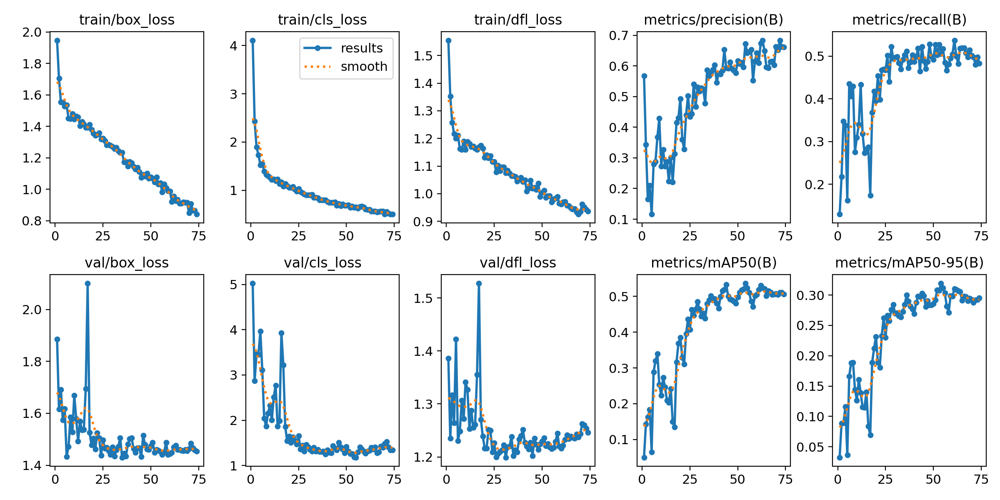
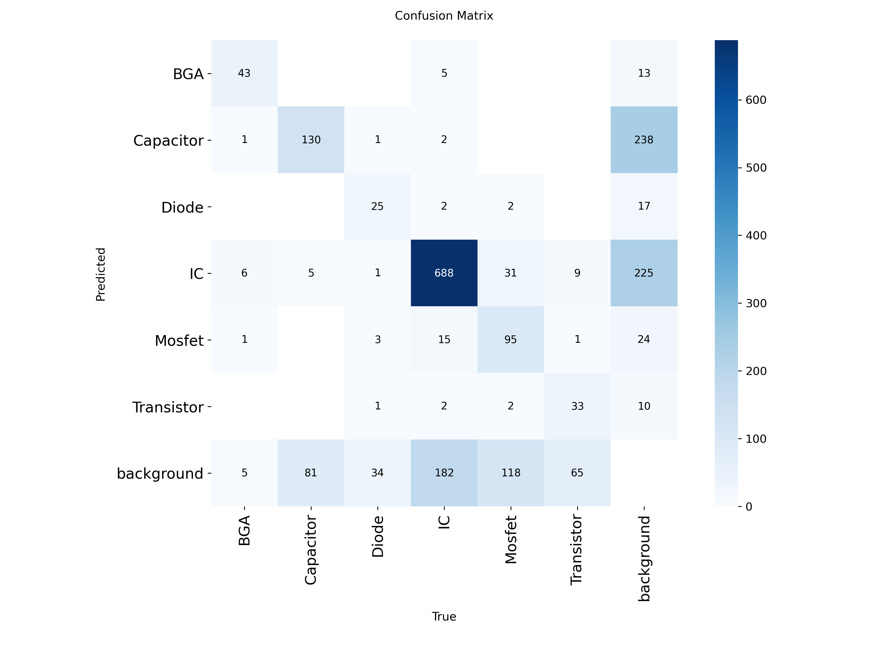
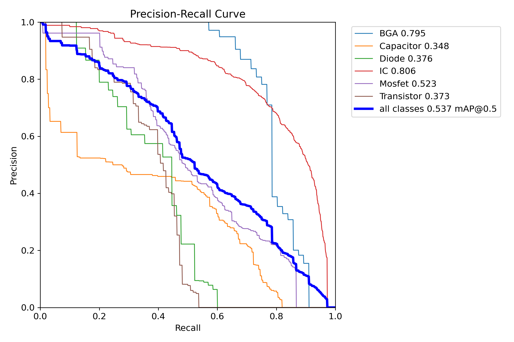
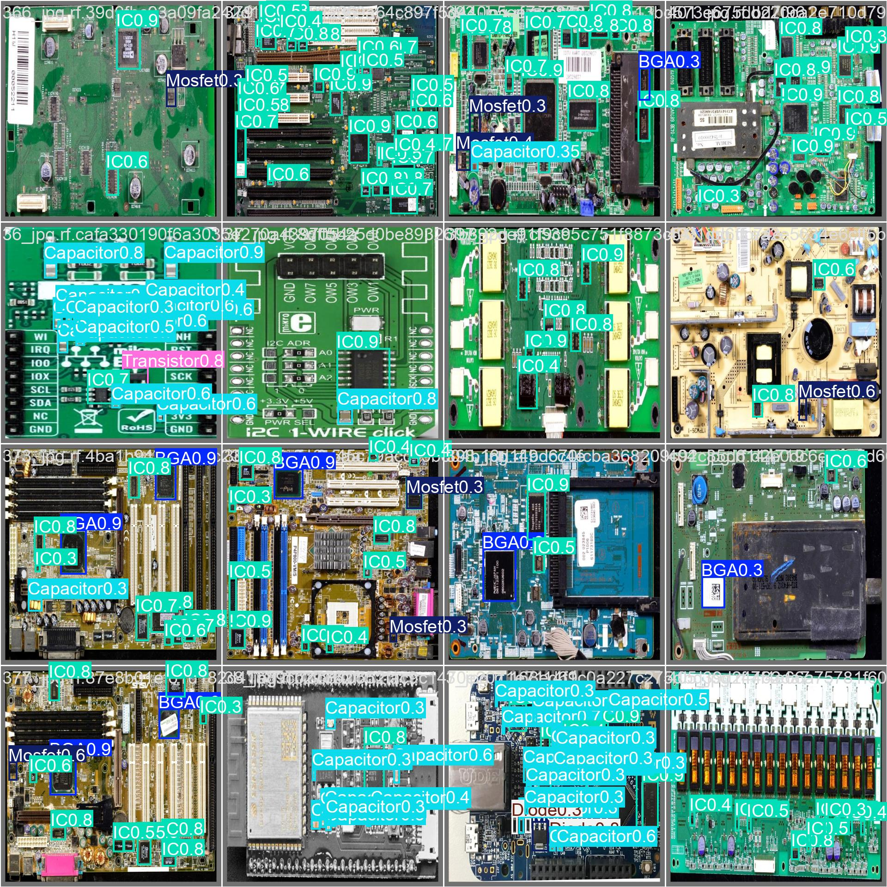
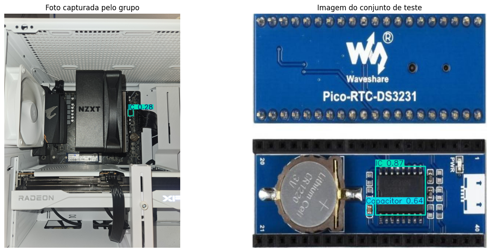

# Detecção de Componentes Eletrônicos em PCB com YOLOv8

Projeto da disciplina de **Deep Learning** (Projeto 3) — detecção de objetos com YOLOv8 aplicada à identificação de componentes eletrônicos em placas de circuito impresso (PCB).

## Integrantes

- Julio Cesar de Sousa Fernandes — 2316701
- Roberto Nascimento Xavier — 2316446
- Cauã Bilhar Dacca — 2315904
- Thiago Neves de Carvalho — 2316921

---

## Sobre o projeto

O objetivo é treinar um modelo de detecção de objetos capaz de localizar e classificar **componentes eletrônicos em PCBs**. As seis classes detectadas são:

`BGA` · `Capacitor` · `Diode` · `IC` · `Mosfet` · `Transistor`

Nenhuma dessas categorias pertence às 80 classes do dataset **COCO** usado no pré-treino do YOLO, atendendo ao requisito de **classe inédita** do projeto.

## Dataset

| Item | Descrição |
|------|-----------|
| Fonte | [PCB Components — Roboflow Universe](https://universe.roboflow.com/rafael-fjjhj/pcb-components-8hkfx-3xa9m) |
| Licença | CC BY 4.0 |
| Total de imagens | 500 |
| Divisão | 272 treino (54%) · 152 validação (30%) · 76 teste (15%) |
| Classes | 6 (BGA, Capacitor, Diode, IC, Mosfet, Transistor) |
| Baseline publicado | mAP@0.5 ≈ 0,486 · Precisão ≈ 0,556 · Recall ≈ 0,476 |

## Tecnologias

- **YOLOv8 (Ultralytics)** — arquitetura de detecção
- **Google Colab** (GPU NVIDIA Tesla T4) — ambiente de treino
- **Roboflow** — sourcing e download do dataset no formato YOLO
- **Python** — PyTorch, matplotlib, PIL

---

## Como executar

O notebook foi desenvolvido para o **Google Colab** com GPU.

1. Abra o arquivo `CDAV3_final.ipynb` no Google Colab.
2. Ative a GPU em **Ambiente de execução → Alterar o tipo de ambiente de execução → GPU (T4)**.
3. Obtenha uma chave de API gratuita do [Roboflow](https://roboflow.com) e substitua o valor `API_KEY` na célula de download:
   ```python
   rf = Roboflow(api_key="SUA_CHAVE_AQUI")
   ```
4. Execute as células em ordem (**Ambiente de execução → Executar tudo**).
5. Na etapa de aplicação prática, a célula `files.upload()` solicitará o envio de uma imagem de PCB para inferência.

> **Observação:** a chave de API **não** deve ser commitada no repositório. Mantenha o placeholder `API_KEY` no código versionado.

### Hiperparâmetros do modelo principal

| Parâmetro | Valor |
|-----------|-------|
| Modelo | YOLOv8m |
| Resolução (`imgsz`) | 640 |
| Épocas | 80 (early stopping, `patience=20`) |
| Batch | 32 |
| Seed | 42 |
| Otimizador | AdamW (automático) |

---

## Resultados

### Métricas no conjunto de teste (modelo principal — 640)

| Métrica | Nosso modelo | Baseline |
|---------|:------------:|:--------:|
| Precisão | **0,614** | 0,556 |
| Recall | **0,488** | 0,476 |
| mAP@0.5 | **0,502** | 0,486 |
| mAP@0.5:0.95 | **0,299** | — |

O modelo supera o baseline publicado do dataset nas três métricas comparáveis.

### Desempenho por classe (teste)

| Classe | Instâncias | Precisão | Recall | mAP@0.5 |
|--------|:----------:|:--------:|:------:|:-------:|
| IC | 249 | 0,789 | 0,799 | 0,820 |
| BGA | 13 | 0,575 | 0,846 | 0,814 |
| Transistor | 97 | 0,882 | 0,464 | 0,563 |
| Mosfet | 45 | 0,631 | 0,266 | 0,305 |
| Diode | 17 | 0,470 | 0,353 | 0,311 |
| Capacitor | 265 | 0,338 | 0,200 | 0,199 |

As classes **IC** e **BGA** apresentam o melhor desempenho; **Capacitor** é a mais difícil, pela grande variação de aparência e tamanho reduzido.

### Experimento comparativo — resolução 640 vs 960

Para testar se aumentar a resolução melhoraria a detecção de componentes pequenos, treinamos uma segunda versão em `imgsz=960`:

| Métrica | 640 (principal) | 960 (experimento) |
|---------|:---------------:|:-----------------:|
| Precisão | **0,614** | 0,506 |
| Recall | 0,488 | **0,535** |
| mAP@0.5 | **0,502** | 0,484 |
| mAP@0.5:0.95 | **0,299** | 0,288 |

A resolução maior **não melhorou o mAP**: o ganho de recall foi compensado por queda de precisão. Isso indica que o fator limitante não é a resolução, mas a **similaridade visual entre classes** e o **volume reduzido de dados**.

---

## Resultados visuais

> **Para o grupo:** crie uma pasta `imagens/` no repositório e suba os arquivos gerados pelo notebook (estão em `runs/detect/pcb_yolov8m/` no Colab). Depois confira se os nomes abaixo batem com os que você subiu.

### Curvas de treino


### Matriz de confusão


### Curva Precisão-Recall


### Predições em imagens de teste


### Aplicação prática — imagem real capturada pelo grupo


Na imagem real capturada pelo grupo, o modelo apresentou desempenho inferior ao do conjunto de teste, detectando poucos componentes. Isso decorre do **domain shift**: a foto, tirada em condições diferentes das do dataset de treino (ângulo, iluminação, escala), representa dados fora da distribuição vista durante o treinamento.

---

## Conclusão

O modelo YOLOv8m treinado superou o baseline publicado do dataset, com mAP@0.5 de 0,502 no conjunto de teste. As principais dificuldades — desempenho baixo em classes pequenas e visualmente semelhantes (Capacitor, Mosfet, Diode) — refletem os desafios inerentes à detecção de componentes em PCB. O experimento com resolução demonstrou que o gargalo do problema não está na resolução de entrada, mas na similaridade entre classes e no tamanho limitado do dataset.

**Melhorias futuras:** ampliar e diversificar o dataset, aplicar técnicas adicionais de *data augmentation*, e capturar imagens de teste em condições mais próximas às do treino para reduzir o *domain shift*.